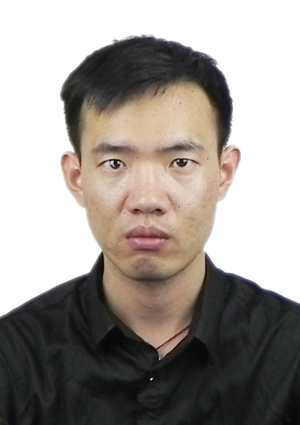
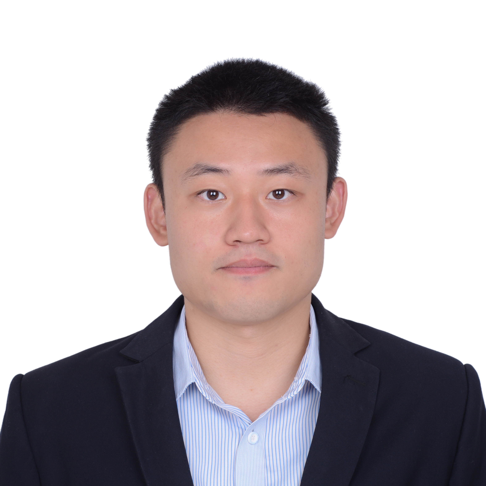
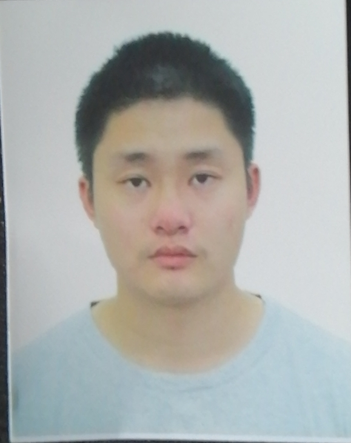

### PhD Student

Yongsheng LIU

- Yongsheng Liu is a graduate student at the Division of Mathematical Sciences, School of Physical and Mathematical Sciences. He joined Ping's research group in August 2017. He received his M.S. (2017) in Geophysics from China University of Petroleum (Beijing) and his B.Sc. (2013) in Geophysics from China University of Petroleum (East China). He is currently working on seismic array imaging based on the hybrid FK-SEM method and adjoint tomography.

Yingyu QI

- Yingyu Qi is a graduate student at the Division of Mathematical Sciences, School of Physical and Mathematical Sciences. He joined Ping's research group in August 2017. He received his B.Sc. (2015) in Mathematics from Sichuan University in China. He is currently working on developing numerical algorithms for solving the Eikonal equation in spherical coordinates.

### Master Student

Yau Wing CHENG
- Yau Wing CHENG is a master student at the Division of Mathematical Sciences, School of Physical and Mathematical Sciences. He joined Ping's research group in August 2018. He received his B.Sc. (2018) in Mathematics from Nanyang Technolgocial University. He is currently working on earthquake relocation with the grid approach.

Xiaoyan LI

- Xiaoyan Li is a master student at the Division of Mathematical Sciences, School of Physical and Mathematical Sciences. He joined Ping's research group in July 2019. He received his B.Sc. (2019) in petroleum engineering from the Texas A&M University.

### Vistting Professor

Wenshuai WANG
-  Associate Professor, School of Mathematics and Statistics, Ningxia University

### Visiting PhD Student

Dongdong WANG
- PhD stuent, Hefei University of Technology

## Previous member

### Visiting PhD Student

Chao ZHANG

- 2008.09 ~ 2012.07，中国地质大学(武汉)，地球物理与空间信息学院地球物理学，学士
- 2012.09 ~ 2018.07，中国科学技术大学，地球和空间科学学院固体地球物理学，博士
- 2016.01 ~ 2017.01，University of Toronto，Department of Earth Sciences，访问博士生
- 2017.09 ~ 2017.10，新加坡南洋理工大学，访问博士生
- 2018.10 ~ 至今(后追踪于2019年8月)，   河海大学海洋学院
