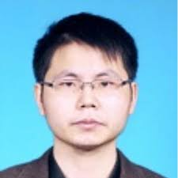
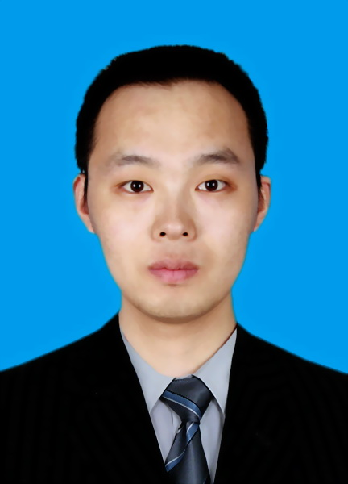

### PhD Student

Yongsheng LIU

- Yongsheng Liu is a graduate student at the Division of Mathematical Sciences, School of Physical and Mathematical Sciences. He joined Ping's research group in August 2017. He received his M.S. (2017) in Geophysics from China University of Petroleum (Beijing) and his B.Sc. (2013) in Geophysics from China University of Petroleum (East China). He is currently working on seismic array imaging based on the hybrid FK-SEM method and adjoint tomography.

Yingyu QI

- Yingyu Qi is a graduate student at the Division of Mathematical Sciences, School of Physical and Mathematical Sciences. He joined Ping's research group in August 2017. He received his B.Sc. (2015) in Mathematics from Sichuan University in China. He is currently working on developing numerical algorithms for solving the Eikonal equation in spherical coordinates.

### Master Student

Yau Wing CHENG
- Yau Wing CHENG is a master student at the Division of Mathematical Sciences, School of Physical and Mathematical Sciences. He joined Ping's research group in August 2018. He received his B.Sc. (2018) in Mathematics from Nanyang Technolgocial University. He is currently working on earthquake relocation with the grid approach.

Xiaoyan LI

- Xiaoyan Li is a master student at the Division of Mathematical Sciences, School of Physical and Mathematical Sciences. He joined Ping's research group in July 2019. He received his B.Sc. (2019) in petroleum engineering from the Texas A&M University.

### Research Associate

Tianjue LI
- Tianjue LI is a research associate at Earth Observatory of Singapore, Nanyang Technological University. He joined Ping's research group in April 2019. He received his M.S. (2018) in Geophysics from Institute of Geology and Geophysics, Chinese Academy of Sciences. He is currently working on seismic reflection inversion for Moho depth determination.

### Vistting Professor

Wenshuai WANG
-  Associate Professor, School of Mathematics and Statistics, Ningxia University

### Visiting PhD Student

Dongdong WANG
- PhD stuent, Hefei University of Technology

## Previous member

### Research Fellow

Shaolin LIU

- Shaolin Liu joined Ping's group in 2017 as a research fellow at Eearth Observatory of Singapore. His primary research areas are in computational and theoretical seismology.
- He received his Ph.D. (2015) in Geophysics from Chinese Academy of Sciences and his B.Sc. (2010) in Geophysics from Yunnan University.
- He left NTU on 2020 Feb. 29, and is now a Researcher at the Institute of Crustal Dynamics, CEA.

Xueyuan HUANG

- 2006年 ~ 2010年，于中国石油大学（华东）数学与应用数学专业毕业，获理学学士学位。
- 2010年 ~ 2016年，于清华大学计算数学专业毕业，获理学博士学位。
- 2016年 ~ 至今(最后追踪于2019年8月)，于北京工商大学理学院数学系授课，任讲师。
- 2017 Sep. ~ 2018 Sep., Research Fellow at Earth Observatory of Singapore, Nanyang Technological University.

### Visiting PhD Student

Chao ZHANG

- 2008.09 ~ 2012.07，中国地质大学(武汉)，地球物理与空间信息学院地球物理学，学士
- 2012.09 ~ 2018.07，中国科学技术大学，地球和空间科学学院固体地球物理学，博士
- 2016.01 ~ 2017.01，University of Toronto，Department of Earth Sciences，访问博士生
- 2017.09 ~ 2017.10，新加坡南洋理工大学，访问博士生
- 2018.10 ~ 至今(后追踪于2019年8月)，   河海大学海洋学院

### Visiting Master Student

Hui LI
- Hui LI joined Ping’s research group in November 2018 as a visiting master student to conduct seismic modelling and imaging studies. During the visiting, she mainly completed seismic tomography research on the source areas of the 2008 Wenchuan earthquake and the 2013 Lushan earthquake.
- She went back to Chengdu University of Technology in April 2019.

Xiachun LU
- Master student, School of Mathematics and Statistics, Ningxia University
