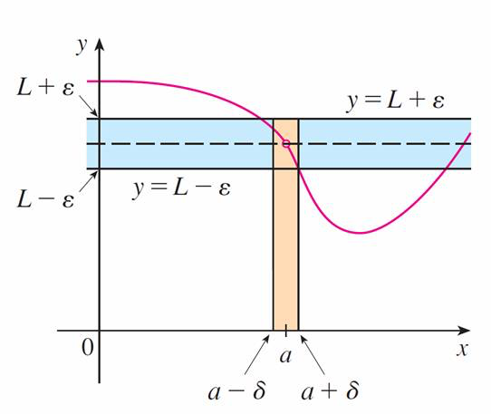
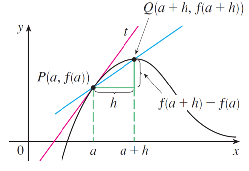
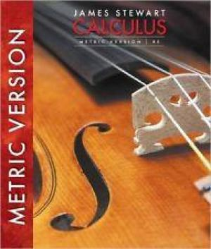

---
# Page title
title: Calculus I

# Title for the menu link if you wish to use a shorter link title, otherwise remove this option.
linktitle: Calculus I

# Page summary for search engines.
summary:

# Date page published
date: 2020-10-10

# Academic page type (do not modify).
type: book
#icon_pack: fas
#icon: chalkboard-teacher

toc: false

# Position of this page in the menu. Remove this option to sort alphabetically.
weight: 10
---

> A core and fundamental course

&nbsp;
## What is Calculus and used for?

The formal study of calculus started from the 17th century by well-known scientists and mathematicians Isaac Newton and Gottfried Leibniz. Calculus is a mathematical discipline that is primarily concerned with functions, limits, derivatives, integrals and infinite series. The emphasis is understanding concepts. The most fundamental concept in calculus is __*limit*__.



&nbsp;
### The Precise Definition of a Limit

Let $ f(x) $ be a function defined on some open interval that contains $ a $, except possibly at $ a $ itself. Then we say that **the limit of** $ f(x) $ **as** $ a $ **approaches** $ a $ **is** $ L $, and we write
$$ \underset{x\rightarrow a}\lim f(x)=L $$
if for every number $ ϵ > 0 $ there is a number $ δ > 0 $ such that
$$ \text{if}\quad 0<|x-a|<\delta\quad\text{then}\quad|f(x)-L|<\epsilon $$



&nbsp;
### Continuity

Let $ f $ be a function and let $ a\in\mathbb{R} $. The function $ f $ is said to be **continuous at the point** $ a $ if the following three things are true:

1. $ f (a) $ is defined (that is, $ a $ is in the domain of $ f $.)
2. The limit $ \underset{x\rightarrow a}\lim f(x) $ exists.
3. $ \underset{x\rightarrow a}\lim f(x)=f(a) $

&nbsp;
### Derivative

The **derivative of a function** $ f $ **at a number** $ a $, denoted by $ f'(a) $, is
$$ f'(a)=\underset{h\rightarrow 0}\lim\frac{f(a+h)-f(a)}{h} $$
if this limit exists.

### [MIT Mathematics](http://www-math.mit.edu/~djk/calculus_beginners/chapter01/section02.html)

> Calculus is the study of how things change. It provides a framework for modeling systems in which there is change, and a way to deduce the predictions of such models.

> Calculus is an exciting subject, justly considered to be one of the greatest achievements of the human intellect. I hope you will discover that it is not only useful but also intrinsically beautiful.

--- James Stewart

&nbsp;
### Reference Textbook

*Calculus*, James Stewart, The 8th, metric edition, Cengage Learning.

&nbsp;
### [Reference Videos by Professor Leonard](https://www.youtube.com/playlist?list=PLF797E961509B4EB5)



