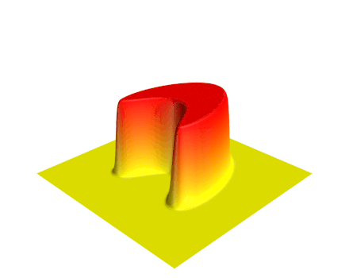

> A teacher is a person who helps others to acquire knowledge, competences or values.

At Nanyang Technological University, I regularly teach [Calculus I](), [Advanced Investigations into Calculus I]() and [Partial Differential Equations](). I taught __*Probability and Introduction to Statistics*__ once in the fall semester of the 2016/2017 academic year.

&nbsp;
## [MH1100: Calculus I]()

The calculus is the branch of mathematics studying the rate of change of quantities (which can be interpreted as slopes of curves) and the length, area, and volume of objects. The calculus is sometimes divided into differential and integral calculus, concerned with derivatives

$$ \frac{{\rm d}}{{\rm d}x}f(x) \quad $$

and and integrals

$$ \int {f(x)} \{\rm d}x, $$

respectively. In Calculus I, we mainly discuss differential calculus and the most important concepts are *limit*, *continuity*, and *differentiation*.

&nbsp;
## [MH9100: Advanced Investigations into Calculus I]()

This course, where students are given challenging problems in calculus to solve, serves as a supplement to [MH1100]() for the students who want to be challenged.

&nbsp;
## [MH4110: Partial Differential Equations]()

Our understanding of the fundamental processes of the natural world is based to a large extent on partial differential equations. A *partial differential equation*, PDE in short, is an identity that relates the independent variables $ x $, $ y $, $ \cdots $, the dependent variable $ u $, and the partial derivatives of $ u $. A PDE can be expressed in the general form

$$ F(x,y,\cdots,u,u_x,u_y,\cdots,u_{xx},u_{xy},u_{yy},\cdots)=0. $$

**Main topics:**

First-order PDE, Wave Equation, Heat Equation, and Laplace Equation.

